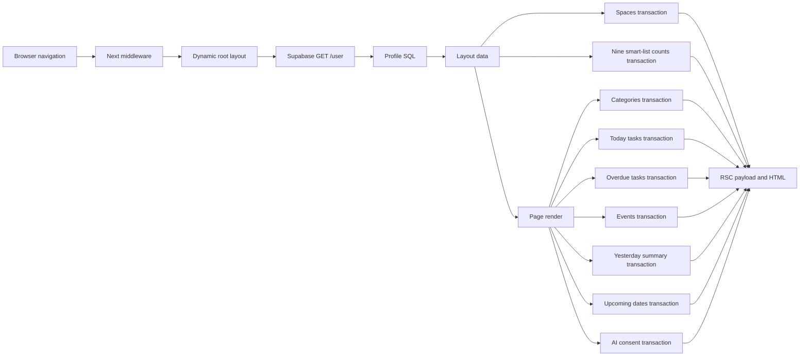
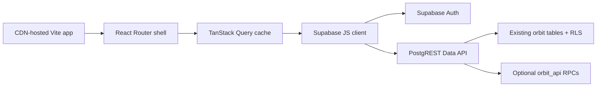

# Orbit browser rebuild — audit and target architecture

Date: 2026-08-19  
Branch inspected: `orbit_v2`

## Executive decision

Orbit should be rebuilt as a static, browser-first React application that talks
to Supabase through the official browser client and relies on the existing RLS
policies for authorisation.

The current database is worth keeping. The current request architecture is not.
The main source of sluggishness is not React, Tailwind, MapLibre, or the LLM. It
is the amount of server and database coordination required before nearly every
navigation can paint.

The rebuild should:

- keep Supabase Auth, the `orbit` schema, RLS, spaces, tasks, notes, events,
  people, places, recurrence, membership, and invitations;
- remove Next.js Server Components, server actions, middleware auth, the custom
  GoTrue client, and direct Postgres access from the request path;
- use a persistent browser shell, client-side routing, cached queries, route
  prefetching, and optimistic mutations;
- omit LLM features, rules, provider integrations, custom sync/offline logic,
  and travel automation from the first release;
- preserve the old tables rather than dropping production data;
- rebuild the visual system for a wide browser viewport while remaining fully
  usable on a phone.

## What was inspected

- 32,252 lines of TypeScript/TSX in `src/`
- 30 page routes, all dynamically rendered
- 41 TSX components, of which 23 are client components
- 90 exported server actions
- 93 `asUser(...)` call sites
- 42 database tables, 33 database functions, 31 explicit policies, and 39 indexes
- 3,259 lines of migrations and 9,558 lines of tests
- the deployed signed-out experience at `orbit-taj.vercel.app`
- the existing visual handoff, architecture decision, status notes, and rebuild
  prompts in `docs/`

No authenticated production timing was possible because this workspace has no
Supabase or database credentials. The deployed sign-in page was 247 ms on a
warm reload, but that does not exercise the expensive authenticated path. A
local production build was also not available because dependencies are not
installed in this workspace. The ranked causes below come from the executed
request graph in the code, not from a synthetic Lighthouse score.

## The current authenticated request path

Each `asUser` transaction performs, sequentially:

1. `BEGIN`
2. `SET LOCAL ROLE authenticated`
3. `set_config('request.jwt.claims', ...)`
4. the actual query
5. `COMMIT`

For the ordinary Today screen, with no free/busy-only spaces, this is roughly
nine RLS transactions plus the direct profile lookup: about 46 SQL commands,
as well as a GoTrue `/user` request. The production deployment is documented as
using `DATABASE_POOL_MAX=1`, so the `Promise.all(...)` calls do not make most of
this database work parallel. They queue it behind one connection.

## Ranked bottlenecks

### 1. Transaction and round-trip amplification — critical, directly evidenced

Every logical read creates a new transaction and repeats the same role and JWT
setup. The root layout and page compose many independent reads. This is the
largest avoidable cost and becomes especially visible when the app server and
Supabase are in different network locations.

Target: one Supabase Data API operation per main screen where practical, two at
most. Use the authenticated browser JWT and let PostgREST establish the request
identity once per HTTP call.

### 2. Every navigation is a fresh dynamic server render — critical

The root layout and 30 pages use `force-dynamic`; middleware sets authenticated
HTML to `no-store`; there are no route loading boundaries or `Suspense`
boundaries. The browser has to ask the Next server for a new RSC response and
the server has to re-establish identity and data before the new screen is useful.

Target: ship one static application shell from a CDN. Change routes in the
browser, keep previous data visible, prefetch likely routes, and update cached
records rather than rebuilding the document.

### 3. Custom auth adds latency and contains a known session failure — critical

`currentSupabaseUser()` verifies the access token with `GET /auth/v1/user` on
every navigation, then fetches the profile. Its refresh path is documented as
broken because a Server Component cannot persist the rotated refresh token.
After expiry, a later refresh can revoke the session family and sign the user
out.

Target: use `@supabase/supabase-js` in the browser with its normal persisted
session and automatic refresh handling. Do not write another token client.

### 4. The global shell blocks on data unrelated to the destination — high

Every authenticated page loads spaces and every smart-list count for the
sidebar before the shell is complete. A calendar or settings navigation pays
for task navigation data even when it does not display it. The sidebar data is
not kept in a browser query cache between routes.

Target: render the shell immediately. Cache spaces for several minutes. Load
navigation counts after the primary screen and invalidate them after relevant
mutations.

### 5. Mutations trigger route-wide work — high

There are 90 server actions and 90 calls to `revalidatePath`. Most interactions
wait for a server action, redirect or revalidation, and then rerun the page read
graph. The visible UI generally has no optimistic cache update.

Target: mutate Supabase directly, update the TanStack Query cache immediately,
rollback on error, and selectively invalidate only affected query keys.

### 6. The Today page violates the original one-payload design — high

The design handoff explicitly called for a single `summary(range)` operation.
The implementation instead requests spaces, categories, two or three task
lists, calendar items, yesterday notes, upcoming dates, and AI consent. The
summary counts are computed consistently from the returned lists, but obtaining
those lists is expensive.

Target: add an optional `orbit_api.dashboard(from_date, to_date)` RPC after the
first browser version works, or issue a maximum of two cached Data API queries.
Return raw recurrence rules and expand them in the existing pure TypeScript
logic if needed.

### 7. Some query shapes fight their indexes — medium now, high with growth

The seed is small, so this is not likely the present-day headline. It will
matter later:

- cross-space task queries do not explicitly filter `space_id`, while the most
  useful due-date index begins with `space_id`;
- each task row uses lateral counts for checklist items and note links;
- `note_links_entity_idx` begins with `space_id`, but the task-row lateral
  lookup does not include it;
- recurrence is expanded in application code up to 400 occurrences per series,
  including a 365-day “All” range.

Target: make the user's readable space IDs part of client list filters so the
existing composite indexes are useful. Run `EXPLAIN (ANALYZE, BUFFERS)` before
adding indexes. Do not add speculative indexes merely because the schema is
large.

### 8. Cold-start risk — medium, inferred rather than measured

Vercel serverless has to start Next, establish a Postgres connection through
Supavisor, call Auth, and execute the dynamic route graph. A warm signed-out
page is fast; an authenticated cold start was not measurable here.

Target: static CDN hosting for the app shell removes the application server and
database connection from initial delivery.

### 9. Client bundle cost is localised, not systemic — low for most routes

The heaviest dependency is MapLibre and it is imported only by the People map
client component. The always-mounted client components—mobile nav, capture FAB,
shortcuts, and service-worker registration—add code, but they are not credible
explanations for multi-second server navigation.

Target: lazy-load MapLibre only when the map tab becomes visible. Keep the
initial route free of map, editor, calendar-grid, and modal code.

## Is AI causing the slowness?

Not materially during ordinary navigation.

The Today page performs one `listConsents` database read and renders AI controls,
but the Anthropic provider is called only after an explicit form submission.
Removing AI will remove one landing-page transaction and a significant amount
of code, consent UI, tests, and conceptual overhead. It will not solve the main
latency by itself.

Recommendation: exclude all LLM UI and providers from the first rebuild. Leave
the `ai_feature_consents` and `ai_runs` tables in place so no production data is
destroyed. A future LLM feature should be a separately deployed API/Edge
Function and never a dependency of core screen rendering.

## Layers to remove from the first rebuild

- Next.js App Router, Server Components, server actions, and request middleware
- direct `postgres.js` access and the custom `asUser` transaction wrapper
- the custom Supabase GoTrue REST implementation
- custom service worker and offline sync/conflict UI
- AI providers and consent surfaces
- calendar, ICS, geocoding, travel, push, and AI provider abstraction pairs
- rules engine UI and scheduler
- travel mode
- mixed Tailwind utility markup plus a 756-line global component stylesheet

These can remain in git history and the old branch. They should not be copied
into the new runtime merely because they exist.

## Data and product capabilities to retain

### First release

- Supabase email/password and magic-link authentication
- spaces, membership, roles, RLS, and invitations
- Today dashboard
- tasks, checklists, assignment, due dates, priority, and recurrence
- calendar day/week/month and free/busy-safe rendering
- people and places
- notes
- deterministic search
- light/dark/system theme, locale, week start, and default compose space
- deterministic local quick capture only if it can be brought across as a
  small isolated module

### Deliberately deferred

- AI/LLM features
- rules/automation and notifications
- external calendar sync and ICS import
- route/travel estimates and travel sessions
- custom offline write queue and conflict resolver
- client-side encryption for locked records
- realtime subscriptions, until the cached single-user experience is fast and
  correct without them

Deferred tables remain untouched. The UI should not promise that these features
exist.

## Target runtime architecture

Recommended stack:

- Vite, React, and strict TypeScript
- React Router
- `@supabase/supabase-js`
- TanStack Query
- one styling method: CSS Modules plus a small token stylesheet
- Lucide or the existing SVG icon shapes, not both
- MapLibre only in a lazy map chunk
- Vitest and Playwright

No Redux, Zustand, ORM, custom API server, BFF, SSR framework, component suite,
animation package, or date library is required for the first release.

The official Supabase browser client persists and refreshes browser sessions;
RLS remains the security boundary. Only the Supabase URL and publishable key may
be in the browser. A service-role key must never enter a `VITE_*` variable.

## Supabase and migration plan

### Required before the browser app can read data

1. Add `orbit` and the new `orbit_api` schema to Supabase **Data API → Exposed
   schemas**.
2. Use `supabase.schema('orbit')` (or set `db.schema = 'orbit'`) in the client.
3. Verify the existing grants and RLS with a real authenticated JWT.

The migrations already grant `USAGE` on `orbit` and per-table CRUD to
`authenticated`, with RLS enabled. Therefore the new visual design itself does
not require a table migration.

### Required additive browser API migration

Add `0018_browser_api.sql`. Direct table CRUD should continue through the
`orbit` schema, but several existing behaviors intentionally use narrow `app.*`
functions and cannot be reproduced safely with table writes alone. Create an
`orbit_api` schema with least-privilege wrappers for only:

- `ensure_account` / `ensure_default_spaces` for pre-migration accounts;
- `create_space`, because the first membership has to be created atomically;
- invite preview/accept/decline;
- space-move preview;
- free/busy one-off and recurring reads.

The wrappers should accept and return Data-API-friendly primitive/JSON types,
run as `SECURITY INVOKER` unless the underlying operation explicitly requires
the already-audited definer function, set a safe `search_path`, revoke default
`PUBLIC` execute, and grant execute only to `authenticated`. Do not expose the
whole `app` schema merely to reach these functions.

### Recommended preferences migration, only when implementing the rebuild

Add `0019_browser_preferences.sql` if theme/default-space choices must follow a
user between devices:

- `profiles.theme`: `system | light | dark`
- `profiles.default_space_id`: nullable FK to `orbit.spaces`, `ON DELETE SET NULL`

`profiles.locale` and `profiles.week_starts_on` already exist. If preferences
may remain browser-local, even this migration is unnecessary.

### Optional performance migration, only after the direct client works

Add a security-invoker dashboard RPC to the dedicated `orbit_api` schema that
returns the Today payload in one call. Grant only the function's `EXECUTE`
permission, and keep RLS active on all underlying tables. Do not add a new
`SECURITY DEFINER` path unless it has a proven need and dedicated RLS tests.

Any new index must be justified by production-shaped `EXPLAIN ANALYZE` output.
Likely candidates, not automatic requirements, are a global open-task due index
and `(entity_kind, entity_id)` for note links.

### Explicitly forbidden migrations

- no table drops or renames in the rebuild migration;
- no moving the `orbit` schema into `public`;
- no disabling RLS;
- no broad anonymous grants;
- no service-role browser path;
- no deletion of AI, sync, rules, or travel data merely because the first UI
  does not expose it.

## Visual direction

The current UI is disciplined but visually too small and narrow for a desktop
browser. The deployed sign-in screen uses a narrow card in a large empty field;
inside the app many reading surfaces are capped at 46 rem. The typography is
predominantly 11–15 px, the hierarchy relies heavily on hairlines, and the wide
viewport is rarely used for simultaneous context.

The rebuild should feel like a calm, premium household control centre rather
than a mobile list stretched onto a desktop:

- warm neutral canvas, clean raised surfaces, ink-like text, and one restrained
  orange accent carried forward from Orbit;
- 240 px collapsible desktop sidebar, compact top command/search bar, and a
  content area that can use 1100–1280 px;
- Today uses two columns on wide screens: agenda and tasks, with a compact
  summary and quick capture above;
- task and note screens use list/detail split views on desktop and separate
  routes on mobile;
- 14–16 px body text, 28–32 px page titles, 44 px minimum touch targets, and
  comfortable but not oversized cards;
- 10–14 px radii, subtle borders, and shadow only for overlays or genuinely
  elevated surfaces;
- space/category colour remains a secondary label and never the only cue;
- no decorative gradients, glassmorphism, oversized marketing headings,
  emoji icons, or hover-only information;
- desktop-first composition with a complete 390 px layout, not desktop-only.

Keep the strong parts of the current design: measured contrast, visible focus,
reduced-motion handling, UK date conventions, colour plus icon plus label,
printable lists, and honest locked/free-busy states.

## Browser compatibility target

- Chrome and Edge 111+
- Firefox 114+
- Safari 16.4+
- current iOS Safari and Android Chrome

Use explicit theme token blocks (`:root`, `[data-theme='dark']`, and a system
media query) rather than depending solely on `light-dark()`, which is newer than
the Safari target. Add a normal colour fallback before any `color-mix()` use.
Use `100vh` before `100dvh`, preserve native form semantics, and test with
Playwright Chromium, Firefox, and WebKit.

## Performance budget for the rebuilt app

- static shell visible without waiting for Supabase data;
- warm client-side route response under 100 ms to visible feedback;
- no blank page during navigation or mutation;
- no more than two Data API calls for a main route, with one preferred;
- initial JavaScript under 180 kB gzip; ordinary route chunks under 80 kB gzip;
- MapLibre/editor/calendar-heavy code absent from the initial chunk;
- LCP under 1.8 s, INP under 150 ms, CLS under 0.05 on a mid-tier mobile profile;
- dashboard and task mutations optimistic with a clear rollback/error state;
- zero horizontal scrolling at 390, 768, 1024, and 1440 px.

## Recommendation

Do not optimise the current architecture incrementally. Fixing the transaction
fan-out, auth refresh, route-wide revalidation, and browser caching while
keeping the server-first design would be a large refactor whose endpoint is
still a server-first app. Preserve the database and domain rules, then replace
the runtime and UI in one clean vertical slice, beginning with auth, shell,
spaces, and Today.
